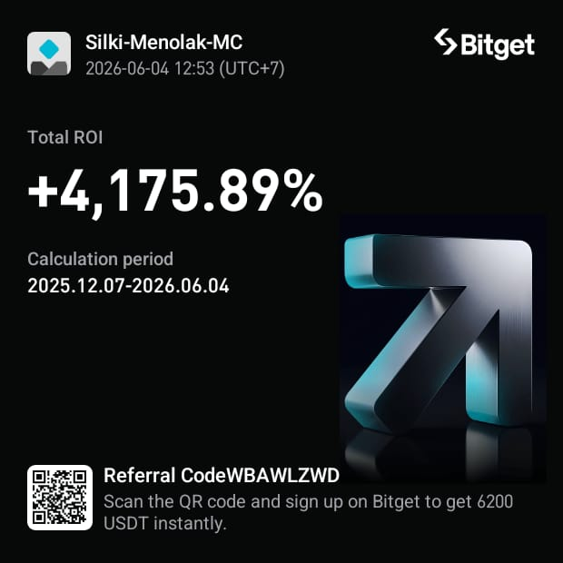
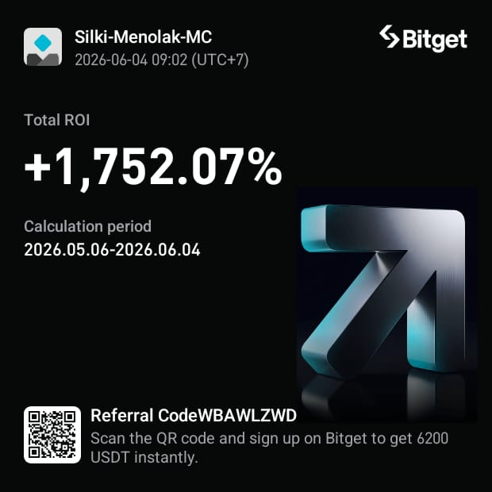
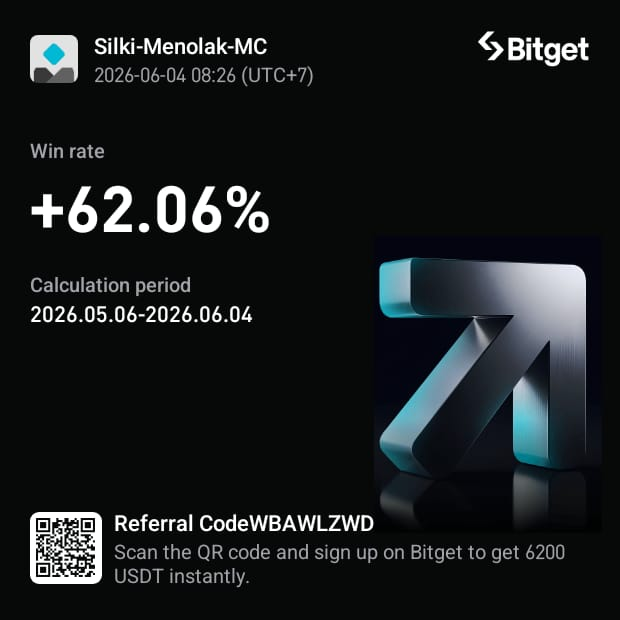
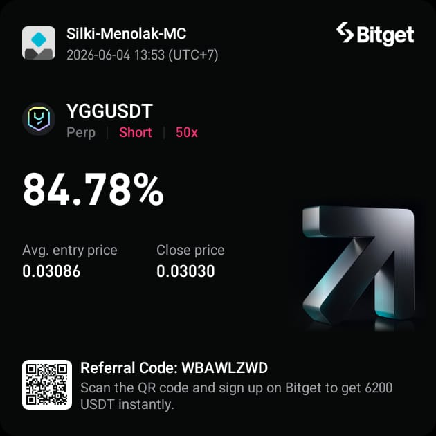
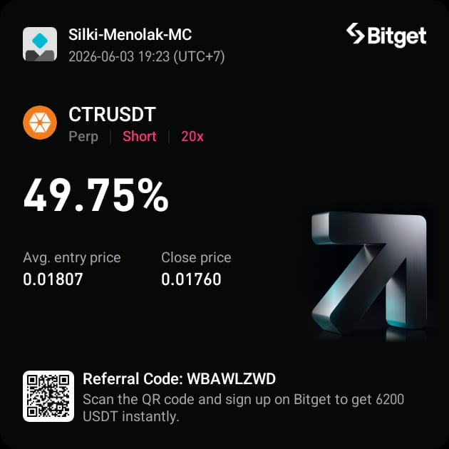
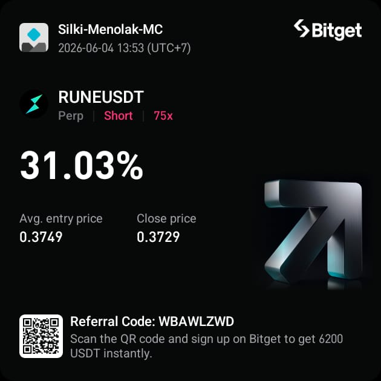
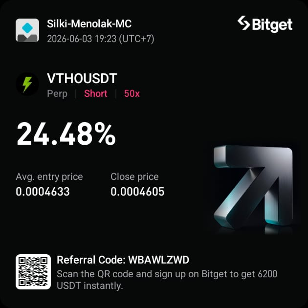
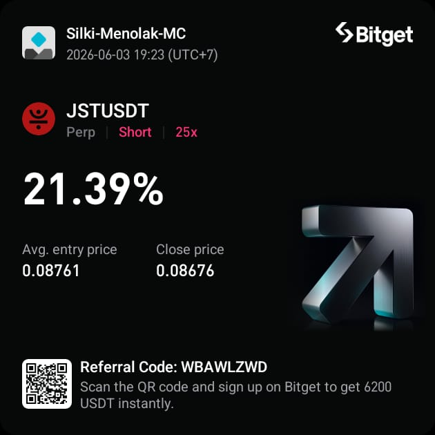
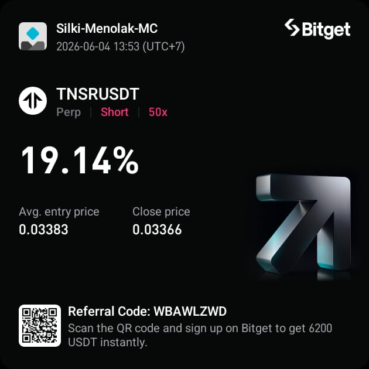
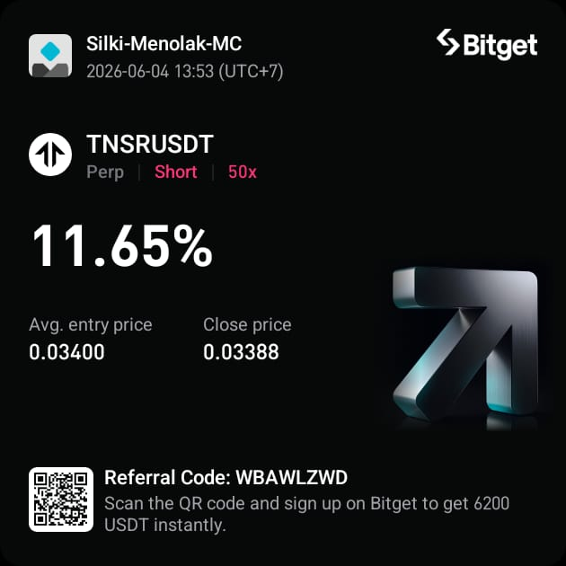

# 🤖 Hyper-Gemma AI Trader

> **Production-ready Autonomous AI Trading System**
> Menggunakan Bitget Futures, Ollama, Gemma 4, MongoDB, Node.js, dan TypeScript

[](#)
[](#)
[](#)
[](#)

## 📈 Live Trading Results

> **Total ROI: +4,175.89%** (Desember 2025 — Juni 2026) | **1-Month ROI: +1,752.07%** | **Win Rate: 62.06%**

<p align="center">
  
  
  
</p>

### Contoh Trade Profit

<p align="center">
  
  
  
  
</p>
<p align="center">
  
  
  
  
</p>

> ⚠️ **Disclaimer:** Hasil masa lalu tidak menjamin performa di masa depan. Gambar di atas adalah hasil trading riil di Bitget.

---

## 📖 Deskripsi Project

**Hyper-Gemma AI Trader** adalah sistem trading cryptocurrency **otonom sepenuhnya** (fully autonomous) yang menggabungkan kecerdasan buatan **Gemma 4** (via Ollama) dengan **Quantitative Mathematics Engine** untuk trading futures di **Bitget Exchange** secara real-time.

Sistem ini menggunakan arsitektur **Hybrid Tactical** — menggabungkan kecepatan kalkulasi matematika murni (**Quant Trinity**: Z-Score + Hurst Exponent + VWAP + Kalman Filter) dengan kecerdasan AI untuk konfirmasi keputusan. **QuantEngine** mendeteksi peluang dalam milidetik menggunakan regime-aware logic (Trend Following vs Mean Reversion), lalu **Gemma AI** memvalidasi sebelum eksekusi.

### 🎯 Filosofi Inti

| Prinsip | Penjelasan |
|---------|------------|
| **Hybrid Intelligence** | Matematika untuk kecepatan, AI untuk kebijaksanaan |
| **Capital Multiplication** | Agresif mencari pertumbuhan modal melalui leverage optimal |
| **Self-Learning** | Sistem belajar dari kesalahan trading sebelumnya |
| **Risk Override** | Risk Manager dapat meng-override keputusan AI |
| **No Emotion** | AI tidak terpengaruh emosi — tidak FOMO, tidak revenge trade |
| **Battle Directive** | Gemma sebagai "Gubernur Strategi" menentukan arah makro setiap jam |

---

## 🏗️ Arsitektur Sistem

Sistem ini menggunakan **Hybrid Tactical Architecture** dengan tiga jalur eksekusi:

```
┌───────────────────────────────────────────────────────┐
│                  SERVER (Entry Point)                 │
│    Hybrid Tactical Engine + Quant Trinity Router      │
├─────────────┬──────────┬──────────┬───────────────────┤
│     API     │   CORE   │ EXCHANGE │     SERVICES      │
│  (Fastify)  │(AI/Quant)│ (Bitget) │ (Trade Orchestr.) │
├─────────────┴──────────┴──────────┴───────────────────┤
│                  DATABASE (MongoDB)                   │
│    Models → Repositories → Mongoose (Directive)       │
├───────────────────────────────────────────────────────┤
│              MONITORING & UTILITIES                   │
│     Prometheus │ Health Check │ Alert Manager         │
└───────────────────────────────────────────────────────┘
```

### Arsitektur Detail:

- **Hybrid Tactical Architecture** — Menggabungkan 3 jalur: Strategy Governor (Cold Path), QuantEngine (Hot Path), dan Gemma AI (Confirmation Path)
- **Battle Directive System** — Gemma mengeluarkan "perintah perang" makro setiap jam yang menentukan bias, threshold, dan agresivitas
- **Quant Trinity Engine** — Mesin matematika murni untuk deteksi peluang dalam milidetik (Z-Score + Hurst Exponent + VWAP)
- **Regime-Aware Execution** — Otomatis memilih strategi: Trend Following (Hurst ≥ threshold) atau Mean Reversion (Hurst < threshold)
- **Strategy-Driven** — Mendukung multiple trading strategy (SCALPING, INTRADAY, SWING)
- **Scan Mode System** — 3 mode pemindaian: VIP (major pairs), HOT50 (top volume), ALL (seluruh market)
- **PAPER Mode Isolation** — Mode simulasi terisolasi: posisi mock dihitung dari session trades, bukan posisi exchange riil
- **AI Feedback Loop** — Hasil trading sebelumnya diinjeksikan ke prompt AI
- **Self-Learning Memory** — MongoDB menyimpan pelajaran dari kesalahan
- **Risk First Trading System** — Risk Manager sebagai penjaga terakhir sebelum eksekusi

---

## 🛠️ Tech Stack

| Kategori | Teknologi |
|----------|-----------|
| **Runtime** | Node.js + TypeScript 6.0 |
| **Web Server** | Fastify 5 |
| **AI Engine** | Ollama + Gemma 4 (gemma4:latest) |
| **Database** | MongoDB Atlas + Mongoose 9 |
| **Exchange** | Bitget Futures API V2 (USDT-FUTURES) |
| **Quant** | simple-statistics + mathjs |
| **Validation** | Zod 4 |
| **Monitoring** | Prometheus (prom-client) |
| **Logger** | Pino + pino-pretty |
| **Scheduler** | node-cron |
| **Crypto** | crypto (HMAC-SHA256 signing) |
| **Math** | Decimal.js (precision) |
| **HTTP** | Axios |

---

## 📁 Struktur Folder Project

```
hyper-gemma-ai-trader/
├── src/
│   ├── server.ts                    # Entry point utama (bootstrap + hybrid tactical engine)
│   ├── config/                      # Konfigurasi aplikasi
│   │   ├── env.ts                   # Environment schema validation (Zod)
│   │   └── constants.ts             # Trading & market constants (MAX_LEVERAGE, RSI_PERIOD, dll)
│   ├── core/                        # Logika inti (AI, Quant, Market, Risk)
│   │   ├── ai/
│   │   │   ├── decision-engine.ts   # Orkestrator keputusan AI + GEMMA_FLIP_BLOCKED guard
│   │   │   ├── strategy-governor.ts # Gubernur Strategi Makro (Cold Path / Commander)
│   │   │   ├── ollama-client.ts     # HTTP client untuk Ollama API (generic + validated JSON)
│   │   │   ├── prompt-builder.ts    # Builder prompt dinamis untuk Gemma
│   │   │   └── learning-engine.ts   # Engine pembelajaran dari kesalahan
│   │   ├── quant/
│   │   │   ├── quant-engine.ts      # Mesin trading matematika kecepatan tinggi (Hot Path)
│   │   │   └── quant-utils.ts       # Utilitas: Z-Score, Hurst, VWAP, Kalman, Velocity
│   │   ├── market/
│   │   │   ├── indicator-engine.ts  # Kalkulator indikator teknikal (EMA, RSI, ATR)
│   │   │   └── market-regime.ts     # Deteksi regime market (Trending/Ranging/Volatile)
│   │   └── risk/
│   │       ├── risk-manager.ts      # Validasi risiko & leverage cap
│   │       └── cooldown-manager.ts  # Sistem cooldown setelah loss
│   ├── exchange/
│   │   ├── bitget.client.ts         # Client API Bitget V2 (HMAC-SHA256 signature)
│   │   ├── market-data.provider.ts  # Provider data market real-time (Bitget)
│   │   └── order.executor.ts        # Eksekutor order ke Bitget (atomic SL/TP preset)
│   ├── database/
│   │   ├── mongo.ts                 # Koneksi MongoDB
│   │   ├── models/
│   │   │   ├── trade.model.ts       # Schema trade (Mongoose)
│   │   │   ├── memory.model.ts      # Schema memory/pelajaran
│   │   │   ├── session.model.ts     # Schema sesi trading
│   │   │   └── directive.model.ts   # Schema Battle Directive (Mongoose)
│   │   └── repositories/
│   │       ├── trade.repository.ts  # Repository akses data trade
│   │       ├── memory.repository.ts # Repository akses data memory
│   │       ├── session.repository.ts # Repository akses data session
│   │       └── directive.repository.ts # Repository akses Battle Directive
│   ├── services/
│   │   ├── trade.service.ts         # Orchestrator eksekusi trade
│   │   └── session.service.ts       # Manajemen sesi trading (lifecycle)
│   ├── api/
│   │   ├── monitoring-api.ts        # Setup Fastify server
│   │   └── routes/
│   │       ├── health.route.ts      # Endpoint /health
│   │       └── metrics.route.ts     # Endpoint /metrics (Prometheus)
│   ├── monitoring/
│   │   ├── metrics.ts               # Custom Prometheus metrics
│   │   ├── health-check.ts          # System health check
│   │   └── alert-manager.ts         # Alert manager (multi-level)
│   ├── types/
│   │   ├── ai.types.ts              # Types untuk AI decision & Ollama
│   │   ├── market.types.ts          # Types untuk market data & account status
│   │   └── enum.types.ts            # Enum untuk trading strategy, mode, action, dll
│   ├── utils/
│   │   ├── json-validator.ts        # Validator JSON ketat (Zod schema: AIDecision + BattleDirective)
│   │   ├── helpers.ts               # Utilitas: formatCurrency, formatCompactNumber, sleep
│   │   └── logger.ts                # Logger configuration (Pino)
│   ├── scripts/                     # Script utilitas dan testing
│   │   ├── backtest.ts              # Script backtesting strategi
│   │   ├── check-balance.ts         # Cek saldo akun Bitget
│   │   ├── simulate-live.ts         # Simulasi trading live
│   │   └── verify-all.ts            # Verifikasi semua komponen sistem
│   ├── tests/                       # Unit & integration tests
│   │   ├── unit/                    # Unit tests
│   │   └── integration/             # Integration tests
│   └── jobs/
│       └── memory-consolidation.job.ts # Job konsolidasi memori harian
├── etc/                             # Dokumentasi & hasil testing
│   ├── ai-promt.json                # Konfigurasi prompt AI & rencana pengembangan
│   ├── BACKTEST_RESULTS.md          # Hasil backtesting
│   ├── SIMULATION_RESULTS.md        # Hasil simulasi
│   ├── FINAL_VERIFICATION.md        # Verifikasi final sistem
│   └── GEMINI.md                    # Catatan AI assistant
├── images/                          # Screenshot hasil trading riil
├── .env                             # Environment variables (tidak di-commit)
├── .env.example                     # Template environment variables
├── .gitignore                       # Git ignore rules
├── LICENSE                          # MIT License
├── package.json                     # Dependencies & scripts
├── tsconfig.json                    # TypeScript configuration
└── README.md                        # Dokumentasi ini
```

---

## 🧩 Detail Fitur

### 1. 🧠 Strategy Governor (Cold Path / Commander)

**File:** `src/core/ai/strategy-governor.ts`

Gemma bertindak sebagai **"Gubernur Strategi"** yang mengeluarkan **Battle Directive** setiap jam. Directive ini menentukan arah makro untuk seluruh sistem:

- **Macro Market Analysis** — Menganalisis BTC dan ETH sebagai barometer pasar
- **Battle Directive Output** — Menghasilkan JSON terstruktur berisi:
  - `bias` — Arah pasar: `LONG`, `SHORT`, atau `NEUTRAL`
  - `z_score_threshold` — Threshold sensitivitas untuk QuantEngine (1.0-5.0)
  - `kalman_aggressiveness` — Agresivitas Kalman Filter (0.01-0.5)
  - `max_leverage` — Leverage maksimal yang direkomendasikan
  - `allowed_symbols` — Daftar simbol yang diperbolehkan
  - `reasoning` — Alasan di balik keputusan
- **Strategy-Adaptive Threshold** — SCALPING mendapat threshold rendah (1.0-1.8), INTRADAY mendapat threshold menengah (1.5-2.5)
- **Persistent Directive** — Disimpan di MongoDB via `DirectiveRepository`, bertahan antar restart
- **Graceful Fallback** — Jika gagal, menggunakan directive terakhir yang tersimpan

---

### 2. ⚡ QuantEngine — Quant Trinity (Hot Path / Math Sensor)

**File:** `src/core/quant/quant-engine.ts`

Mesin trading matematika murni yang bekerja dalam **milidetik** tanpa memanggil AI, menggunakan **3 sinyal utama (Trinity)**:

- **OHLCV Data Pipeline** — Mengambil data candlestick lengkap (Open, High, Low, Close, Volume) via `getOHLCVHistory()` dari Bitget
- **Dual Window Analysis** — Menggunakan 2 jendela data:
  - **Short Window (20 candles)** → Untuk Z-Score (anomali jangka pendek)
  - **Long Window (100 candles)** → Untuk Hurst Exponent (deteksi regime)
- **Regime-Aware Execution Logic** — Otomatis memilih strategi berdasarkan Hurst Exponent:
  - **MODE A: Trend Following** (Hurst ≥ threshold) → Entry pada Kalman Bullish + Price above VWAP (momentum sehat)
  - **MODE B: Mean Reversion** (Hurst < threshold) → Entry pada Z-Score extreme + Micro-Bounce + Value area (dekat/di bawah VWAP)
- **VWAP Confirmation** — Daily VWAP (reset 00:00 UTC) sebagai value/premium area detector
- **Kalman Trend Filter** — Anti-noise: **Adaptive Gain** Kalman Filter yang menyesuaikan noise berdasarkan volatilitas lokal, dikontrol oleh `kalman_aggressiveness` dari Directive
- **Directive-Driven** — Menggunakan `z_score_threshold`, `bias`, dan `kalman_aggressiveness` dari Battle Directive
- **Strategy-Adaptive Hurst Threshold** — SCALPING: `>= 0.50`, INTRADAY/SWING: `>= 0.60` (inclusive `>=` — konsisten di QuantEngine, DecisionEngine, dan Server)
- **NEUTRAL Safety** — Jika bias NEUTRAL, menggunakan threshold ketat 2.2 untuk kedua arah
- **Instant Decision** — Menghasilkan `AIDecision` lengkap (confidence, leverage, regime, hurst, vwap deviation) tanpa latency AI

**File:** `src/core/quant/quant-utils.ts`

Utilitas matematika yang digunakan oleh QuantEngine:

| Fungsi | Deskripsi |
|--------|-----------|
| `calculateZScore(prices)` | Mengukur deviasi standar harga terakhir dari mean (short window) |
| `hurstExponent(prices)` | **Multi-Scale R/S Analysis** — Menggunakan sub-window scales (8, 16, 32, 64 candles), menghitung R/S per chunk, lalu OLS linear regression pada log-log plot untuk mendapatkan slope H |
| `calculateVWAP(ohlcv)` | Volume Weighted Average Price: Σ(TP × Vol) / Σ(Vol) |
| `vwapDeviation(price, vwap)` | Deviasi harga terhadap VWAP dalam persentase |
| `applyKalmanFilter(prices, noise)` | **Adaptive Gain Kalman** — Menghitung local volatility (std dev 10 candle terakhir), lalu menyesuaikan `measureNoise` secara dinamis: volatilitas tinggi → filter lebih konservatif. Fallback ke scalar Kalman untuk sample < 10 |
| `calculateVelocity(prices)` | **Weighted Least Squares (WLS)** — Linear regression dengan exponential decay weights (decay=0.1): candle terbaru mendapat bobot terbesar |

**OHLCV Interface:**
```typescript
interface OHLCV {
  t: number;  // timestamp
  o: number;  // open
  h: number;  // high
  l: number;  // low
  c: number;  // close
  v: number;  // volume
}
```

---

### 3. 📝 Prompt Builder (Konstruktor Prompt Dinamis)

**File:** `src/core/ai/prompt-builder.ts`

Membangun prompt terstruktur dalam Bahasa Indonesia untuk model Gemma:

- **Strategy-Adaptive Prompt** — Instruksi berbeda berdasarkan `TRADING_STRATEGY`:
  - `SCALPING` → **Aggressive Scalping** — fokus Volatility Bursts, Volume Spikes, Price Anomalies, profit instan
  - `INTRADAY/SWING` → Konfirmasi trend solid, ruang nafas untuk SL, target profit lebar
- **System Instruction** — Persona **"Hyper-Gemma Ultra"** sebagai AI Scalping Engine agresif
- **Regime Context Injection** — **[NEW]** Menyuntikkan `regimeContext` (Hurst, regime TRENDING/RANGING, Trio Direction) ke prompt:
  - `MARKET REGIME ALERT (MANDATORY)` — Jika regime = TRENDING, Gemma WAJIB mengikuti Trio Direction atau return WAIT
  - Mencegah AI mengembalikan arah berlawanan (ditegakkan oleh `GEMMA_FLIP_BLOCKED` di Decision Engine)
- **Small Account Optimization** — Instruksi leverage tinggi (rata kanan) khusus akun mikro agar memenuhi minimum order $5
- **Tight SL/TP Instruction** — Wajib memberikan target SL/TP dalam % pergerakan harga yang ketat
- **Enhanced Market Context** — Menyertakan `high_24h` dan `low_24h` untuk analisis range harian
- **Account Context** — Menyertakan equity, PnL harian, dan loss streak
- **Memory Injection** — Menyuntikkan pelajaran dari trading sebelumnya
- **Response Schema** — Memaksa output JSON dengan format ketat (12 field)
- **Prinsip Capital Multiplication** — Eksekusi peluang dengan probabilitas profit tertinggi

---

### 3.5. 🛡️ Decision Engine — AI Sniper + GEMMA_FLIP_BLOCKED

**File:** `src/core/ai/decision-engine.ts`

Orkestrator keputusan trading AI yang menggabungkan analisis Gemma dengan **hard constraint** matematika:

- **Pre-AI Risk Check** — Memeriksa posisi penuh atau safety risk sebelum memanggil AI
- **Continuous Learning** — Menginjeksikan 5 trade terakhir sebagai pelajaran ke prompt (threshold: minimal 5 trades)
- **Regime Context Injection** — Menghitung Hurst secara independen untuk menyuntikkan context ke Prompt Builder
- **Synchronized mathDir** — Menerima `mathDir` (trioDirection) langsung dari QuantEngine via `server.ts`, memastikan sinkronisasi sempurna antara sinyal matematika dan guard constraint
- **GEMMA_FLIP_BLOCKED (Hard Constraint)** — **Fitur kritis** yang mencegah Gemma membalik arah trading saat regime TRENDING:
  - Menggunakan `mathDir` dari QuantEngine (bukan recalculate) — **single source of truth**
  - Jika regime TRENDING dan Gemma mencoba arah berlawanan → **Force WAIT**
  - Contoh: Jika `mathDir = LONG` dan Gemma return `SHORT` → Diblokir dengan log `⚠️ GEMMA_FLIP_BLOCKED`
  - Menggunakan **inclusive** Hurst check (`>=` threshold) — konsisten dengan QuantEngine
- **Symbol Injection** — Menyuntikkan `symbol` ke keputusan AI (type-safe)
- **Final Risk Validation** — Keputusan AI divalidasi ulang oleh Risk Manager sebelum eksekusi
- **Fallback Decision** — Jika engine gagal, mengembalikan `SKIP` dengan `risk_level: HIGH`

---

### 4. 📚 Learning Engine (Mesin Pembelajaran)

**File:** `src/core/ai/learning-engine.ts`

Sistem self-learning yang menyimpan dan mengkonsolidasi pelajaran:

- **Memory Consolidation** — Konsolidasi memori dari trade sebelumnya
- **Record Lesson** — Mencatat pelajaran baru ke koleksi Memory di MongoDB
- **Upsert Pattern** — Update jika pelajaran serupa sudah ada, buat baru jika belum
- **Occurrence Tracking** — Melacak frekuensi kesalahan yang sama terulang
- **Kategori Memory** — ENTRY, EXIT, RISK, PSYCHOLOGY

---

### 5. 📊 Indicator Engine (Mesin Indikator Teknikal)

**File:** `src/core/market/indicator-engine.ts`

Menghitung indikator teknikal dari data candlestick:

| Indikator | Metode |
|-----------|--------|
| **EMA 20** | Exponential Moving Average 20 periode |
| **EMA 50** | Exponential Moving Average 50 periode |
| **RSI 14** | Relative Strength Index 14 periode |
| **ATR 14** | Average True Range 14 periode (null-safe) |

---

### 6. 🌍 Market Regime Detector (Deteksi Kondisi Market)

**File:** `src/core/market/market-regime.ts`

Mengklasifikasikan kondisi market saat ini berdasarkan indikator:

| Regime | Kondisi |
|--------|---------|
| **VOLATILE** | RSI > 70 atau RSI < 30 |
| **TRENDING** | ADX > 25 |
| **RANGING** | ADX < 20 |
| **UNCLEAR** | Kondisi lainnya |

---

### 7. 🛡️ Risk Manager (Manajemen Risiko)

**File:** `src/core/risk/risk-manager.ts`

Layer perlindungan modal yang dapat meng-override keputusan AI:

- **Dynamic Max Positions** — Membatasi jumlah posisi aktif berdasarkan `MAX_POSITIONS` di environment (default: 2, configurable)
- **Duplicate Position Block** — Memblokir pembukaan posisi baru pada koin yang sudah dipegang (type-safe: `decision.symbol`)
- **Strategy-Dynamic Liquidation Safety** — Threshold likuidasi berbeda per strategi:
  - `SCALPING` → 15% jarak minimum ke harga likuidasi (lebih toleran karena leverage tinggi)
  - `INTRADAY/SWING` → 30% jarak minimum (lebih konservatif)
- **Leverage Cap** — Membatasi leverage hingga maksimal 500x
- **Silent Pre-Scan** — Log validasi disuprekan untuk `PRE_SCAN_CHECK` (mengurangi noise log)
- **Position Sizing** — Kalkulasi ukuran posisi berdasarkan tingkat risiko:
  - `NORMAL` → 100% dari safe margin
  - `REDUCED` → 50% dari safe margin
  - `SMALL` → 25% dari safe margin
- **Trading Blocked** — Memblokir trade baru jika posisi penuh, ada safety risk, atau duplicate coin

---

### 8. ⏳ Cooldown Manager (Sistem Pendinginan)

**File:** `src/core/risk/cooldown-manager.ts`

Mengelola periode cooldown setelah kerugian beruntun:

- **Start Cooldown** — Mengaktifkan cooldown selama N menit (default: 30 menit)
- **Check Active** — Mengecek apakah cooldown masih aktif
- **Auto Reset** — Otomatis reset ketika waktu cooldown berakhir
- **Remaining Time** — Menampilkan sisa waktu cooldown dalam menit

---

### 9. 🔌 Bitget Client (Koneksi Exchange)

**File:** `src/exchange/bitget.client.ts`

Client lengkap untuk Bitget Futures API V2 dengan autentikasi HMAC-SHA256:

| Fitur | Deskripsi |
|-------|-----------|
| **HMAC-SHA256 Signing** | Tanda tangan kriptografis menggunakan `crypto.createHmac` |
| **Get Candles** | Mengambil data candlestick (klines) untuk analisis |
| **Get Price History** | Shortcut: mengambil array harga close untuk QuantEngine |
| **Get All Tickers** | Mengambil semua 24h ticker sekaligus (normalized format) |
| **Get Account Balance** | Mengambil saldo akun (USDT-FUTURES) |
| **Get Positions** | Mengambil posisi-posisi aktif |
| **Get Symbol Info** | Mengambil `quantityPrecision`, `pricePrecision`, `maxLeverage`, dan `minTradeUSDT` per simbol |
| **Place Order** | Membuat market/limit order dengan **Atomic SL/TP** (`presetStopLossPrice` + `presetTakeProfitPrice`) |
| **Place TPSL Order** | Membuat TP/SL order terpisah via `place-tpsl-order` (planType: `profit_plan`/`loss_plan`, holdSide) |
| **Set Leverage** | Mengatur leverage per simbol (PAPER mode: simulated) |
| **Set Prefix** | Konfigurasi `clientOid` prefix untuk diferensiasi bot vs script |

**Order Modes:**
- `tradeSide: 'open'` + `posSide: 'net'` — Unilateral/net position mode
- **Atomic SL/TP** — SL/TP dikirim dalam request yang sama via `presetStopSurplusPrice` + `presetStopLossPrice`
- **Standalone TPSL** — `placeTPSLOrder()` untuk SL/TP terpisah dengan `holdSide` (`long`/`short`)

**Autentikasi:**
- Menggunakan **HMAC-SHA256** signing (`timestamp + method + path + body`)
- Headers: `ACCESS-KEY`, `ACCESS-SIGN`, `ACCESS-TIMESTAMP`, `ACCESS-PASSPHRASE`
- Product Type: `USDT-FUTURES`

**PAPER Mode:**
- `placeOrder()` → Return mock orderId tanpa mengirim ke exchange
- `placeTPSLOrder()` → Return mock orderId untuk TP/SL
- `setLeverage()` → Simulated tanpa API call (KYC Bypass)

---

### 10. 📈 Market Data Provider (Penyedia Data Market)

**File:** `src/exchange/market-data.provider.ts`

Aggregator data market yang menggabungkan raw data dari Bitget dengan indikator teknikal:

- **Strategy-Adaptive Interval** — Menggunakan timeframe `5m` untuk SCALPING dan `1h` untuk INTRADAY/SWING
- **Real-time Market Data** — Mengambil klines dan ticker dari Bitget V2
- **Indicator Calculation** — Menghitung EMA20, EMA50, RSI, ATR dari data candlestick
- **Trend Detection** — Menentukan trend (BULLISH/BEARISH/NEUTRAL) dari EMA crossover
- **24h High/Low Data** — Mengambil `high_24h` dan `low_24h` dari raw Bitget ticker
- **Aggregated Account Metrics** — Menghitung equity, available balance, margin ratio, maintenance margin, margin balance, dan total wallet balance
- **Active Position Filtering** — Filter posisi dengan `total ≠ 0` dan normalisasi field names
- **Position Field Mapping** — Memetakan `holdSide` (arah posisi) dan `marginUsed` (`marginSize`/`margin`) dari Bitget ke format internal
- **Virtual Balance Fallback** — Dalam PAPER mode dengan $0 balance, menyediakan virtual $1.00 untuk simulasi
- **LIVE Mode Position Isolation** — Dalam LIVE mode, hanya posisi yang memiliki matching trade di session aktif yang dihitung (mencegah interferensi posisi manual)
- **PAPER Mode Position Isolation** — Dalam PAPER mode, posisi riil di exchange diabaikan:
  - Mock positions dibangun dari `sessionTrades` di sesi aktif saat ini
  - Mock positions menyertakan `holdSide` dan `marginUsed` yang disimulasikan
  - Setiap mock position menggunakan 10% estimated margin usage
  - Hanya trade dari `currentSessionId` yang dihitung (isolasi antar sesi)
  - Mencegah double-counting saat restart simulasi

---

### 11. 💹 Order Executor (Eksekutor Order)

**File:** `src/exchange/order.executor.ts`

Mengeksekusi order ke Bitget dengan proteksi otomatis dan optimisasi leverage:

- **Dynamic Notional Sizing** — Ukuran order ditentukan oleh formula:
  - `TARGET_NOTIONAL = max(SAFETY_FLOOR, available_balance × MAX_TRADE_ALLOCATION)`
  - `SAFETY_FLOOR = max(symbolInfo.minTradeUSDT, MIN_TPSL_NOTIONAL, 5.5)` — memastikan notional cukup besar untuk SL/TP placement
  - `MIN_TPSL_NOTIONAL` dikonfigurasi via environment (default: 10 USDT)
  - `MAX_TRADE_ALLOCATION` dikonfigurasi via environment (default: 20% dari balance)
- **Dynamic Quantity** — Menghitung kuantitas: `ceil(TARGET_NOTIONAL / price)` dengan presisi simbol
- **Exchange-Aware Leverage** — Mengambil `maxLeverage` langsung dari kontrak Bitget per simbol
- **Auto-Leverage Optimization** — Menaikkan leverage otomatis jika saran AI terlalu rendah:
  - `ceil(targetNotional / (available * 0.98))` — 2% buffer
  - Capped by `maxExchangeLeverage` per simbol
- **2% Safety Buffer** — Final affordability check: `marginUsed = targetNotional / finalLeverage` vs `available * 0.98`
- **Detailed Sizing Log** — Mencatat `targetNotional`, `marginUsed`, `finalLeverage`, dan `qty` per order
- **Precision Handling** — Menggunakan `Math.ceil` untuk memastikan kuantitas selalu ≥ minimum
- **Price Tracking** — Mengembalikan harga eksekusi aktual untuk pencatatan entry price yang akurat
- **Atomic SL/TP (Preset)** — SL/TP dikirim **dalam request yang sama** dengan market order (bukan Plan Order terpisah):
  - `presetStopLossPrice` + `presetTakeProfitPrice` dimasukkan ke body `place-order`
  - `SCALPING/INTRADAY` → SL 1.5%, TP 2.5% (RR ~1:1.67)
  - `SWING` → SL 3%, TP 10% (RR 1:3.3)
  - **Benefit:** SL/TP dijamin terpasang, tidak ada race condition atau partial fill

---

### 12. 🔄 Trade Service (Layanan Trading)

**File:** `src/services/trade.service.ts`

Orkestrator yang menghubungkan keputusan AI dengan eksekusi order:

- **Decision Handling** — Memfilter keputusan SKIP/WAIT dan hanya mengeksekusi LONG/SHORT
- **Order Execution** — Meneruskan order ke Order Executor
- **Session Linking** — Menghubungkan setiap trade ke session aktif via `SessionService`
- **Accurate Entry Price** — Menyimpan harga eksekusi aktual dari Order Executor
- **Database Logging** — Menyimpan setiap trade ke MongoDB dengan detail lengkap
- **Error Handling** — Menangkap dan mencatat error eksekusi

---

### 13. 🗄️ Database Layer (Lapisan Database)

#### Models

| Model | File | Deskripsi |
|-------|------|-----------|
| **Trade** | `trade.model.ts` | Setiap trade yang dieksekusi (pair, action, PnL, ai_reasoning) |
| **Memory** | `memory.model.ts` | Pelajaran dari kesalahan (kategori, severity, occurrence) |
| **Session** | `session.model.ts` | Sesi trading (mode, start/end time, total trades) |
| **BattleDirective** | `directive.model.ts` | **[NEW]** Perintah strategi makro dari Gemma (bias, threshold, leverage) |

#### BattleDirective Schema

```typescript
{
  bias: 'LONG' | 'SHORT' | 'NEUTRAL',
  z_score_threshold: number,        // Sensitivitas QuantEngine
  kalman_aggressiveness: number,     // Agresivitas filter noise
  max_leverage: number,              // Leverage maks yang direkomendasikan
  allowed_symbols: string[],         // Simbol yang diperbolehkan
  last_updated: Date                 // Timestamp directive terakhir
}
```

#### Repositories
- `trade.repository.ts` — CRUD untuk trade records
- `memory.repository.ts` — Upsert pelajaran trading
- `session.repository.ts` — Lifecycle management sesi
- `directive.repository.ts` — **[NEW]** `getLatest()` dan `update()` untuk Battle Directive (upsert single document)

---

### 14. 🔧 Monitoring & API

#### Prometheus Metrics
**File:** `src/monitoring/metrics.ts`

| Metric | Tipe | Deskripsi |
|--------|------|-----------|
| `trader_trades_total` | Counter | Total trades yang dieksekusi |
| `trader_decisions_total` | Counter | Total keputusan AI (per label) |
| `trader_pnl_total` | Gauge | Total Profit and Loss |
| Default Metrics | Auto | CPU, memory, event loop, dll. |

#### Health Check
**File:** `src/monitoring/health-check.ts`
- System uptime
- Memory usage (heap, RSS, external)
- Database connection status
- Timestamp

#### Alert Manager
**File:** `src/monitoring/alert-manager.ts`
- Alert dengan 3 level severity: LOW, MEDIUM, HIGH
- Balance threshold alert (jika saldo < $1)
- Console error untuk alert CRITICAL
- Placeholder untuk integrasi Telegram/Discord/Slack

---

### 15. ♾️ Hybrid Tactical Engine & Background Jobs

**Arsitektur hybrid:** Menggabungkan 3 jalur eksekusi secara paralel.

| Komponen | Tipe | Jadwal | Deskripsi |
|----------|------|--------|-----------|
| **Strategy Governor** | Cron `0 * * * *` | Setiap 1 jam | Gemma mengeluarkan Battle Directive baru |
| **Hybrid Tactical Loop** | `while(true)` | Terus-menerus | Trinity scan (Z+Hurst+VWAP) → Gemma confirm → Execute |
| **Memory Consolidation** | Cron `0 0 * * *` | Setiap tengah malam | Konsolidasi pelajaran harian |

**Hybrid Tactical Loop:**
```
runHybridTradingLoop(mode) {
  1. Strategy Governor: Refresh Battle Directive (initial)

  while (true) {
    2. Cek Account & Risk Status
       - Jika Safety Block ATAU Max Positions → Portfolio Snapshot → Wait 10s → Retry
    3. Fetch All Tickers → Filter berdasarkan SCAN_MODE:
       - VIP: 17 major pairs (BTC, ETH, BNB, XRP, SUI, TON, dll)
       - HOT50: Top 50 by volume
       - ALL: Seluruh market
    4. Loop setiap hot pair:
       a. 📊 TRINITY SENSOR (Instant, 100 candles):
          - Ambil OHLCV history → Hitung Z-Score (20 candle) + Hurst (100 candle) + VWAP
          - Determine regime: Hurst >= threshold → TRENDING, else → RANGING
          - Pulse log: [PULSE] BTCUSDT | Z: -1.85 (-1.50) | H: 0.62 [TRND]
          - MODE A (Trending, H ≥ threshold): Kalman + VWAP momentum → Hit!
          - MODE B (Ranging, H < threshold): Z-Score extreme + Bounce + VWAP value area → Hit!
          - Return trioDirection (Kalman direction) untuk sinkronisasi guard
       b. 🤖 AI SNIPER (Gemma confirms, dengan mathDir dari Trinity):
           - Kirim ke Decision Engine + mathDir → Gemma validasi
           - GEMMA_FLIP_BLOCKED guard menggunakan mathDir dari step (a)
           - Jika LONG/SHORT → TACTICAL STRIKE → Execute (Atomic SL/TP)
           - Jika SKIP/WAIT → TACTICAL VETO → Skip
       c. ⏱️ Micro-delay 50ms antar pair
    5. Wait 1s → Ulang dari step 2
    * On crash → Wait 5s → Retry
  }
}
```

**Scan Mode System:**

| Mode | Pairs | Deskripsi |
|------|-------|-----------|
| `VIP` | 17 pairs | Major crypto: BTC, ETH, ASTER, BNB, XRP, ZEC, XLM, SUI, TON, BCH, LINK, ADA, AVAX, LTC, TRX, ETC, HYPE |
| `HOT50` | Top 50 | Diurutkan berdasarkan 24h volume tertinggi |
| `ALL` | Semua | Seluruh pasangan di Bitget USDT-FUTURES |

**Engine Features:**
- **Real-time Trinity Pulse** — Visual tracking Z-Score + Hurst + Regime setiap pair di terminal (`\r` overwrite)
- **Trinity-First, AI-Second** — QuantEngine Trinity (milidetik) → Gemma AI (detik) hanya jika Trinity signal aktif
- **Smart Safety Block** — Khusus block hanya untuk `Blocked: Safety` (bukan max positions), wait 10s
- **Tactical Strike/Veto** — Logging eksplisit untuk setiap keputusan (konfirmasi atau tolak)
- **API-Friendly** — Micro-delay 50ms antar pair evaluation

---

### 16. ✅ Validasi & Safety

**File:** `src/utils/json-validator.ts`

Validasi JSON ketat menggunakan Zod schema untuk dua jenis output AI:

#### AIDecision Schema
- `decision` → Preprocess ke uppercase, fallback ke `SKIP`
- `confidence_score` → 0-100
- `market_regime` → Preprocess ke uppercase, fallback ke `UNCLEAR`
- `risk_level` → Preprocess ke uppercase, fallback ke `MEDIUM`
- `leverage_suggestion` → 1-500
- `position_size` → Preprocess ke uppercase, fallback ke `NORMAL`
- 6 field string tambahan (entry_reason, risk_factors, stop_loss_logic, dll)

#### BattleDirective Schema (NEW)
- `bias` → `LONG` | `SHORT` | `NEUTRAL`
- `z_score_threshold` → 1-5
- `kalman_aggressiveness` → 0.001-1.0
- `max_leverage` → 1-500
- `allowed_symbols` → Array string
- `reasoning` → String

#### JSON Extraction
- `extractJsonFromResponse()` — Mengekstrak JSON dari response AI yang mungkin mengandung teks tambahan
- Mencari `{` pertama dan `}` terakhir dari response string

---

### 17. 🤖 Ollama Client (Koneksi AI)

**File:** `src/core/ai/ollama-client.ts`

Client untuk Ollama API yang mendukung dua mode generasi:

- **`generateDecision(prompt)`** — Khusus untuk trading decisions dengan validasi `AIDecision` schema
- **`generateValidatedJson<T>(prompt, validator)`** — **[NEW]** Generic method untuk validated JSON generation (digunakan oleh Strategy Governor)
- **`generateRawJson(prompt)`** — Internal helper untuk raw JSON tanpa validasi spesifik
- **Mock AI Mode** — Jika `MOCK_AI=true`, return mock decision tanpa memanggil Ollama
- **Timeout 5 Menit** — Timeout diperbesar untuk model besar seperti Gemma 4
- **Clean Error Logging** — Hanya log error message, bukan seluruh axios error object

---

### 18. 📋 Type System (Sistem Tipe)

#### Enum Types (`src/types/enum.types.ts`)

| Enum | Values |
|------|--------|
| `TradingStrategy` | `SCALPING`, `INTRADAY`, `SWING` |
| `TradingMode` | `PAPER`, `LIVE` |
| `TradeAction` | `LONG`, `SHORT`, `WAIT`, `SKIP` |
| `MarketRegime` | `TRENDING`, `RANGING`, `VOLATILE`, `UNCLEAR` |
| `RiskLevel` | `LOW`, `MEDIUM`, `HIGH` |
| `SessionMode` | `NORMAL`, `SAFE_MODE`, `COOLDOWN` |
| `MemoryCategory` | `ENTRY`, `EXIT`, `RISK`, `PSYCHOLOGY` |
| `PositionSize` | `SMALL`, `NORMAL`, `REDUCED` |
| `TradeResult` | `WIN`, `LOSS`, `BREAKEVEN` |

#### Market Types (`src/types/market.types.ts`)
- `MarketData` — Data market lengkap (harga, indikator, trend, `high_24h`, `low_24h`, `price_change_24h`)
- `AccountStatus` — Status akun lengkap:
  - Core: `current_equity`, `open_positions`, `daily_pnl`, `loss_streak`
  - Extended: `available_balance`, `margin_ratio`, `maintenance_margin`, `margin_balance`, `total_wallet_balance`

---

## 🔄 Trading Pipeline (Alur Trading)

```
 0. 🚀 Bootstrap: Connect DB → Start API → Init Session
         │
 1. 📜 Strategy Governor: Initial Battle Directive
         │
 ┌───────┤ PARALLEL EXECUTION
 │       │
 │  PATH 1: 🧠 COLD PATH (Every 1 hour)
 │       │     └─ Strategy Governor → Gemma Macro Analysis → Save Directive to DB
 │       │
 │  PATH 2: ⚡ HOT PATH (Continuous Loop)
 │       │     ┌─ Account & Risk Check
 │       │     │     └─ Safety Block? → Wait 10s → Retry
 │       │     │
 │       │     ├─ Fetch All Tickers → Filter by SCAN_MODE (VIP/HOT50/ALL)
 │       │     │
 │       │     ├─ Loop hot pairs:
 │       │     │     ├─ 📊 TRINITY SENSOR: OHLCV → Z-Score + Hurst + VWAP
 │       │     │     ├─ [PULSE] Regime detection: TRND (Trend) or RNG (Range)
 │       │     │     │
 │       │     │     ├─ If TRINITY HIT (Mode A: Trend H≥T / Mode B: Reversion H<T):
 │       │     │     │     ├─ 🤖 AI SNIPER: Gemma confirms/vetoes
 │       │     │     │     ├─ ⚡ TACTICAL STRIKE → Auto-Leverage → Execute → SL/TP
 │       │     │     │     └─ ❌ TACTICAL VETO → Skip → Next pair
 │       │     │     │
 │       │     │     └─ ⏱️ Micro-delay 50ms
 │       │     │
 │       │     └─ Wait 1s → Next cycle
 │       │
 │  PATH 3: 📅 Memory Consolidation (Daily at 00:00)
 │       │
 └───────┘
```

---

## 🚀 Cara Menjalankan

### Prerequisites
- **Node.js** LTS
- **MongoDB** (Atlas atau lokal)
- **Ollama** terinstal dan running (`ollama serve`)
- **Model Gemma 4** terinstal di Ollama (`ollama pull gemma4:latest`)
- **Bitget Account** dengan API Key, Secret Key, dan Passphrase

### Setup

```bash
# 1. Install dependencies
npm install

# 2. Setup environment variables
cp .env.example .env
# Edit .env dengan konfigurasi yang sesuai

# 3. Build
npm run build

# 4. Jalankan
npm start

# Atau untuk development:
npm run dev
```

### Environment Variables

| Variable | Deskripsi | Default |
|----------|-----------|---------|
| `NODE_ENV` | Environment | `development` |
| `LOG_LEVEL` | Level logging | `info` |
| `PORT` | Port monitoring API (Fastify) | `3000` |
| `MONGODB_URI` | URI koneksi MongoDB | — (wajib) |
| `OLLAMA_BASE_URL` | URL server Ollama | `http://localhost:11434` |
| `OLLAMA_MODEL` | Model Ollama yang digunakan | `gemma:7b-instruct` (kode), `gemma4:latest` (.env.example) |
| `MOCK_AI` | Aktifkan mock AI (tanpa Ollama) | `false` |
| `BITGET_API_KEY` | API Key Bitget | — (wajib) |
| `BITGET_SECRET_KEY` | Secret Key Bitget | — (wajib) |
| `BITGET_PASSPHRASE` | Passphrase Bitget | — (wajib) |
| `BITGET_BASE_URL` | Base URL Bitget API | `https://api.bitget.com` |
| `TRADING_MODE` | Mode trading: `PAPER` (simulasi) atau `LIVE` | `PAPER` |
| `MAX_POSITIONS` | Jumlah maksimal posisi aktif bersamaan | `1` |
| `MAX_TRADE_ALLOCATION` | Persentase balance per trade (0.0-1.0) | `0.20` (20%) |
| `MIN_TPSL_NOTIONAL` | Minimum notional agar SL/TP bisa terpasang (USDT) | `10` |
| `TRADING_STRATEGY` | Strategi trading: `SCALPING` / `INTRADAY` / `SWING` | `INTRADAY` |
| `SCAN_MODE` | Mode pemindaian market: `VIP` / `HOT50` / `ALL` | `VIP` |
| `BACKTEST_ITERATIONS` | Jumlah iterasi backtesting | `5` |

---

## 🔮 Roadmap & Scalability

### ✅ Sudah Diimplementasi
- [x] **Hybrid Tactical Architecture** (Quant Trinity + Gemma AI Confirmation)
- [x] **Strategy Governor / Battle Directive System** (Gemma sebagai Commander setiap jam)
- [x] **Quant Trinity Engine** (Z-Score + Hurst Exponent + VWAP + Kalman Filter)
- [x] **Regime-Aware Execution** (Trend Following vs Mean Reversion berdasarkan Hurst)
- [x] **Dual Window Analysis** (Short 20 candles + Long 100 candles)
- [x] **OHLCV Data Pipeline** (Full candlestick data dari Bitget)
- [x] **Bitget Futures API V2** (HMAC-SHA256, market orders, atomic SL/TP)
- [x] **PAPER Mode Position Isolation** (mock positions dari session trades, bukan exchange riil)
- [x] **LIVE Mode Position Isolation** (filter posisi by session trades)
- [x] **Scan Mode System** (VIP / HOT50 / ALL)
- [x] **Real-time Trinity Pulse** (Z-Score + Hurst + Regime terminal visualization)
- [x] AI Decision Engine dengan Gemma 4
- [x] **Trading Strategy System** (SCALPING / INTRADAY / SWING)
- [x] **Auto-Leverage Optimization** (auto-increase + exchange-aware cap)
- [x] **Dynamic Notional Sizing** (MAX_TRADE_ALLOCATION + minTradeUSDT + MIN_TPSL_NOTIONAL safety floor)
- [x] **Atomic SL/TP** (preset params dalam request market order, bukan plan order terpisah)
- [x] **TPSL Order Support** (`place-tpsl-order` endpoint dengan holdSide + planType)
- [x] **trioDirection Passthrough** (QuantEngine → server.ts → DecisionEngine — single source of truth)
- [x] **holdSide/marginUsed Mapping** (field posisi dari Bitget V2 dipetakan akurat)
- [x] **Duplicate Position Block** (cegah double exposure pada koin yang sama)
- [x] **Dynamic Liquidation Threshold** (SCALPING 15%, INTRADAY/SWING 30%)
- [x] **GEMMA_FLIP_BLOCKED** (hard constraint: blokir AI flip arah saat regime TRENDING)
- [x] **Adaptive Kalman Filter** (volatility-adjusted measureNoise dengan local std dev)
- [x] **Multi-Scale Hurst Exponent** (R/S analysis pada 4 skala: 8, 16, 32, 64 candles + OLS regression)
- [x] **WLS Price Velocity** (Weighted Least Squares dengan exponential decay weights)
- [x] **Regime Context Prompt Injection** (Hurst + regime + trioDirection disuntikkan ke prompt Gemma)
- [x] **Validated JSON for Both AI Schemas** (AIDecision + BattleDirective via Zod)
- [x] Indikator teknikal (EMA, RSI, ATR) dengan null-safety
- [x] Risk Management & Leverage Cap (500x)
- [x] Dynamic Max Positions (configurable via `MAX_POSITIONS`)
- [x] Pre-AI Risk Validation (skip AI jika posisi penuh)
- [x] Session Management (lifecycle tracking)
- [x] Reusable Portfolio Snapshot (equity, margin, ROE, liq price)
- [x] Safety Block Pattern (mencegah trade saat API gagal)
- [x] Trade History dengan exit_reason & mistake_analysis
- [x] Self-Learning Memory System
- [x] Monitoring API (Prometheus + Fastify)
- [x] Backtesting & Simulation
- [x] Comprehensive Type Safety (Zod + TypeScript)
- [x] **Enhanced Market Data** (high_24h, low_24h untuk analisis range)
- [x] **Clean Error Logging** (axios error message only, bukan full object)
- [x] **Hurst-Adaptive Strategy Selection** (SCALPING H>=0.50, INTRADAY H>=0.60 — inclusive)
- [x] **VWAP Value/Premium Area Detection** (daily reset 00:00 UTC)

### 🔜 Rencana Pengembangan
- [ ] **Volatility Spike Detector** — Filter event-driven moves (change24h > 10% + volume spike > 3x average) menggunakan data MarketData yang sudah ada. Mencegah entry saat pump/dump ekstrem yang tidak diprediksi oleh Trio.
- [ ] Multi-agent trading
- [ ] Vector memory embeddings
- [ ] RAG-based market memory
- [ ] Sentiment analysis
- [ ] Portfolio balancing AI
- [ ] Web dashboard
- [ ] Telegram/Discord alert integration

---

## 📄 Lisensi

MIT License © 2026 Silki

---

> **⚠️ Disclaimer:** Sistem ini dibuat untuk tujuan eksperimen dan edukasi. Trading cryptocurrency memiliki risiko tinggi. Gunakan dengan bijak dan pahami risiko yang ada.
